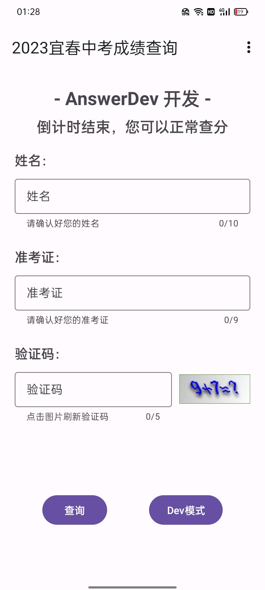
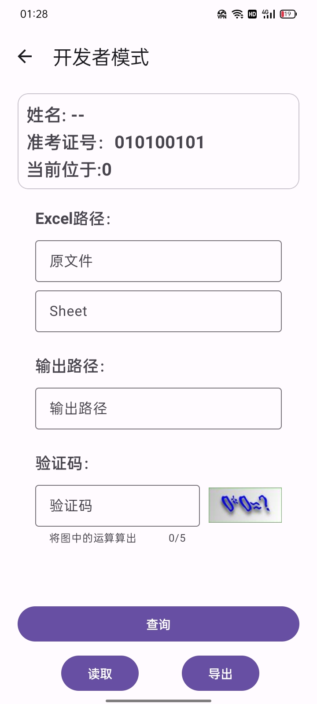

# YiChunZKCX
宜春市中考成绩查询应用，支持Excel表格

# 主要功能
1. 查询中考成绩（关闭入口后也可以，除了api被关闭就查询不了了）
2. 批量查询（读取Excel文件）

# 软件截图

# 免责声明
本项目根据“宜春市中考成绩查询网站”的查询api开发，仅用于学习交流提升查询效率，如果有影响到了正常查询或是被恶意使用，我会立刻删除项目，并向您表达深切的歉意

# Bug和功能反馈
如果您觉的我的项目有问题欢迎提issue，或是发送邮件给 nswera929@gmail.com，我会尽力解决

# 隐私问题
本软件项目开源，任何有关隐私问题您可以查看源码，您所查询的数据并不会上传到其他服务器或泄露，所有接口均来自宜春市中考成绩查询官网

# 数据来源
Api接口来源：宜春市教育体育局
数据来源：宜春市大数据发展管理局

感谢以上事业单位和政府机关的为中考成绩查询所做的努力，
并且感谢您们的查询接口使这个项目能够正常使用

