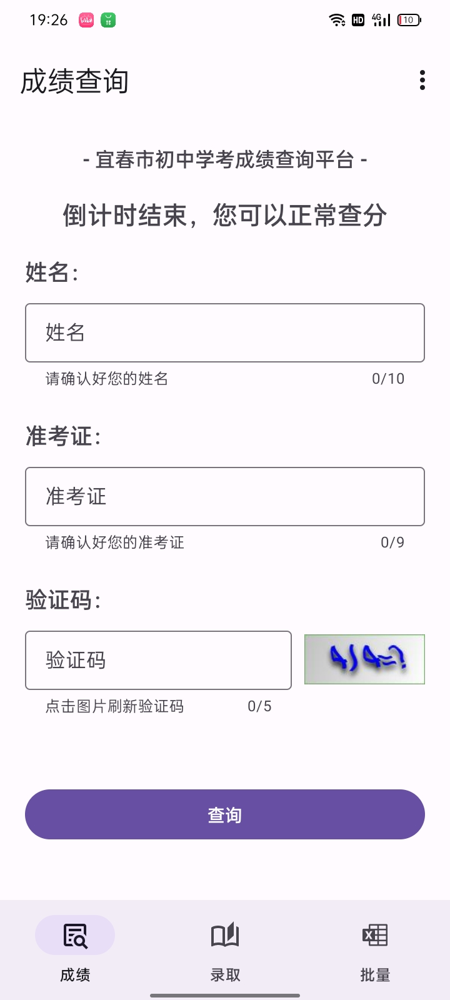
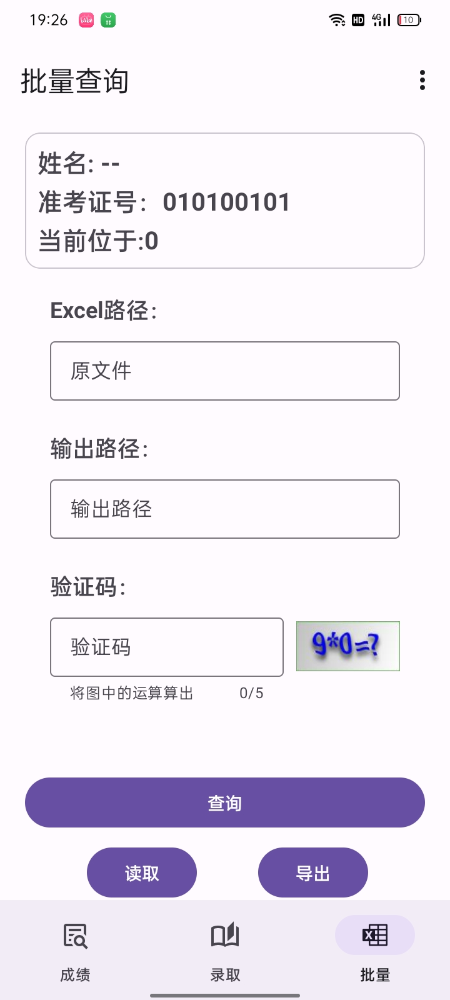

# YiChunZKCX
宜春市中考成绩查询应用，支持Excel表格，支持录取查询

# 主要功能
1. 查询中考成绩
2. 批量查询成绩并导出
3. 更新中考的录取查询

# 软件截图

# 免责声明
本项目根据“宜春市中考成绩查询网站”与“江西省高中阶段学校招生电子化管理平台”的api开发，仅用于学习交流提升查询效率与方便考生查询成绩与录取，如果有影响到了正常查询或是被恶意使用，首先向各位考生表达深切的歉意，并且我会及时向有关单位反馈此时及时处理

# Bug和功能反馈
如果您觉的我的项目存在问题(主要是我的代码很烂)，欢迎提issue，或是发送邮件给 nswera929@gmail.com，我会尽力解决问题

# 隐私问题
本软件项目开源，任何有关隐私问题您可以查看源码，您所查询的数据并不会上传到其他服务器或泄露，所有接口均来自官网

# 数据来源
Api接口来源：宜春市教育体育局 和 江西省高中阶段学校招生电子化管理平台
数据来源：宜春市大数据发展管理局

# 致谢
感谢以上事业单位和政府机关的为中考所做的努力，
并且感谢您们的接口使这个项目能够运行下去

